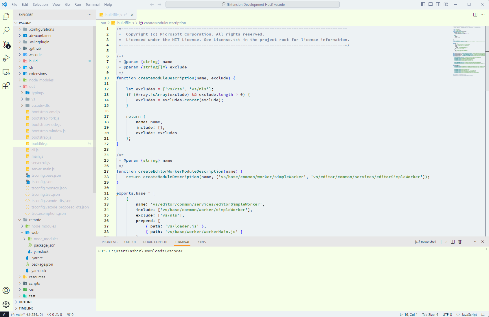

  
 

 <h1 align="center">
  Nerd Theme for VS code
  </h1>
  

A light theme for Visual studio code editor

## Installation

1. Open Extensions in Visual Studio Code in the sidebar panel.
2. Seacrh for "Nerd Theme"
3. Click on "Install".
4. File > Preferences > Color Theme > "Nerd"
